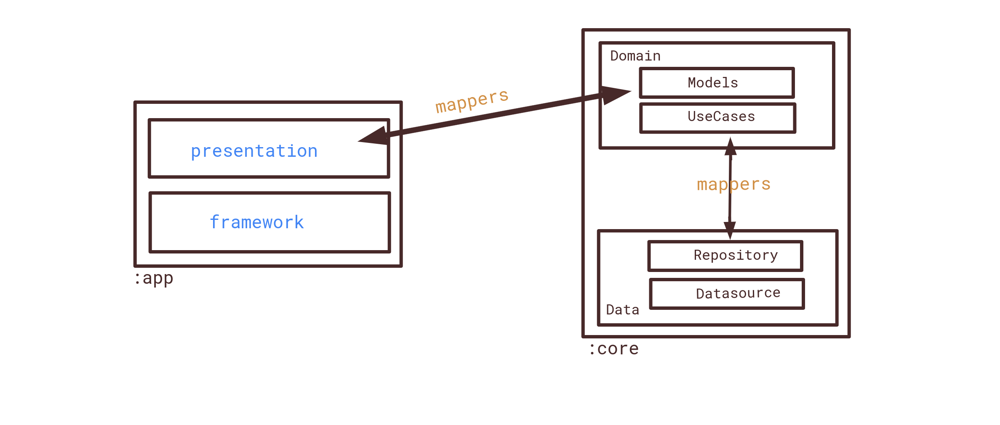
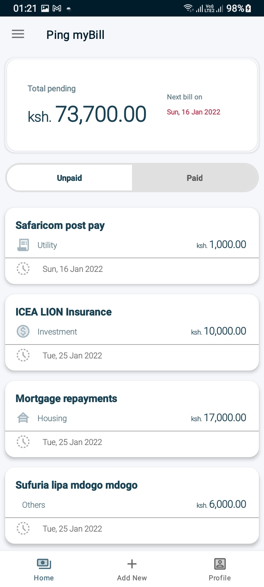
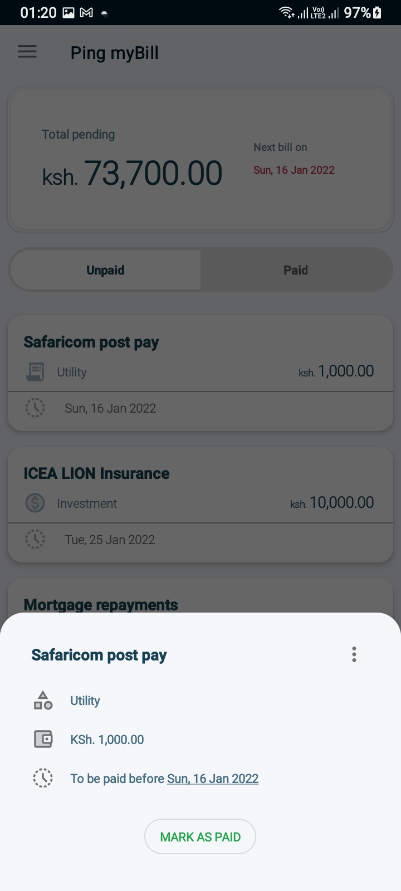
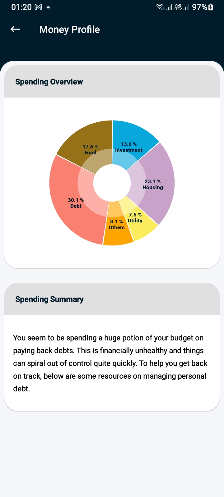
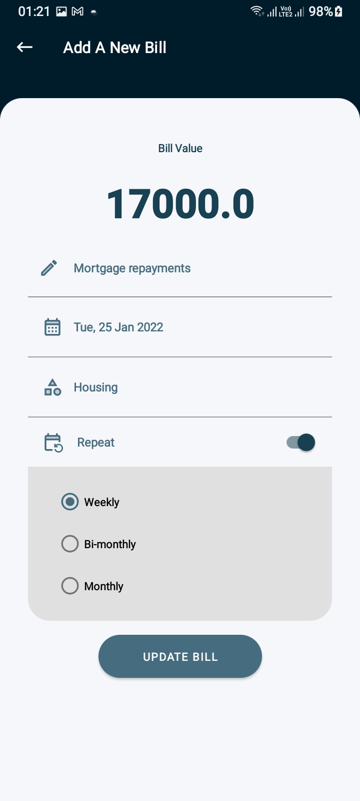
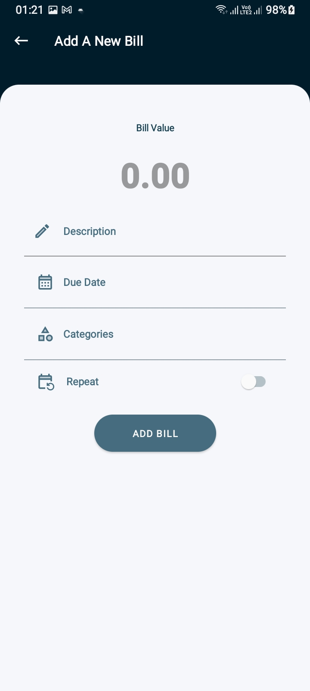
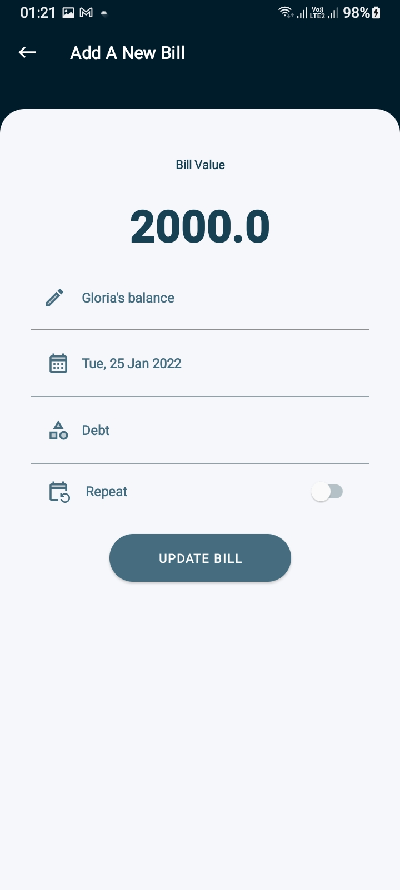

  

# Ping myBills

An android app to help you track your bills. It is built with the clean architecture principles in mind while following the MVVM repository pattern and powered by Architecture Components.

## Table of Contents
- [Architecture](#architecture)
- [Libraries](#libraries)
- [Testing](#testing)
- [Related Posts](#posts)
- [Demo](#demo)
- [TODO](#todo)

## Architecture
For better abstration, we split the application into three layers spread across two distinct modules. This ensures robustness and makes our app extensible. The two modules are:

- :core
- :app

The :app modules contains the UI layer while the :core module contains the domain and the data layer. This three layered architecture is inspired by the [Clean Architecture design pattern](https://blog.cleancoder.com/uncle-bob/2012/08/13/the-clean-architecture.html)

### :app module
The app module holds the `framework` and the `presentation` packages. The `framework` package holds non-core-ui implementations while the `presentation` layer is dedicated to core UI implementations.
#### presentation
The presentation layer use `ViewModel` to manage application state and `data-binding` to hook ViewModels to reactive views.

### :core module
The core module holds the domain and data layers.
#### Domain Layer
The `domain layer` defines data classes that are used to bridge the data needs of the data and presentation layer. It also defines the `UseCases` that the presentation layer reuses for various accessibility and manipulation of the data.
#### Data Layer
The `data layer` holds the the data entity that implements our core business needs. It uses distinct `datasources` abstracted away by a repository to ensures a single channel for accessing and manipulation of the data. 

## Libraries
The following Libraries are used in the application:
- [Android Jetpack](https://developer.android.com/jetpack)
    - [Room Database](https://developer.android.com/training/data-storage/room) - Used for local data storage.
    - [Navigation Component](https://developer.android.com/guide/navigation/) - Elegantly handle navigation using the one Activity/multiple fragment pattern
    - [Data Binding](https://developer.android.com/topic/libraries/data-binding) - Used in combination with ViewModel to provide support for reactive views
    - [ViewModel](https://developer.android.com/topic/libraries/architecture/viewmodel) - Manages the UI state and provide the bridge between the UI and Domain layer.
    - [WorkManager](https://developer.android.com/topic/libraries/architecture/workmanager/basics) - Schedules repeating bills and reminds user when they are due.
- [Hamcrest](http://hamcrest.org/) - Preferred assertion framework for tests to make our tests readable.
- [Robolectric](http://robolectric.org/) - Simulates tests that rely on the android framework.
- [Glide](https://github.com/bumptech/glide) - Preferred image loading library   
- [MPAndroidChat](https://github.com/PhilJay/MPAndroidChart/tree/pie-images) - To display beautifully crafted chats

## Demo
|||||
|:----:|:----:|:----:|:----:|

|||
|:----:|:----:|

## TODO
- This is the fist version of the app and a lot of things are not optimal.
- This ReadMe is WIP, obvs.

Google Play and the Google Play logo are trademarks of Google LLC.